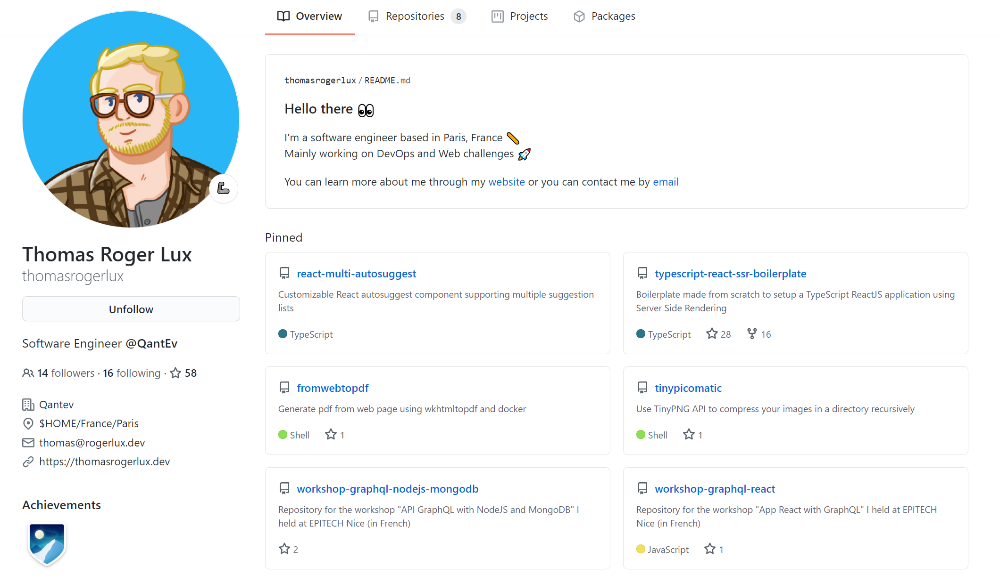
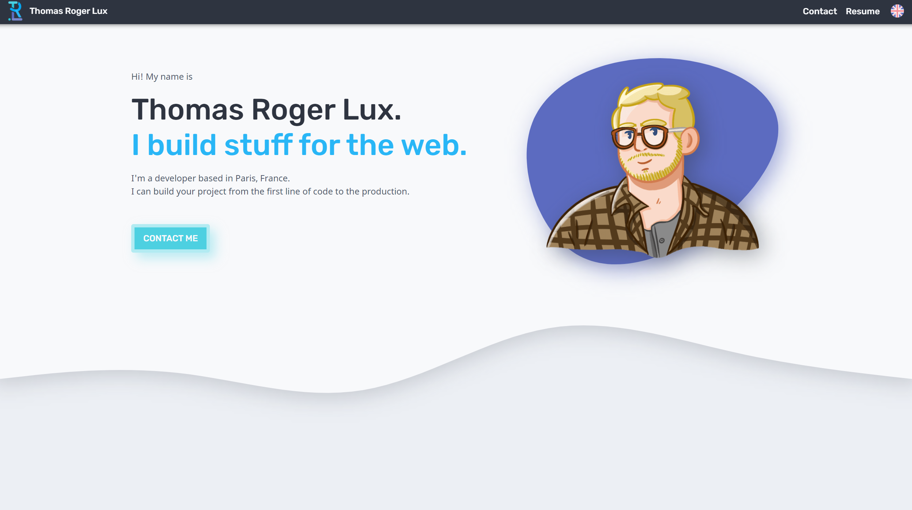

#### <em>애들이 나이가 너무 어린데 경력은 4년이야😮</em>

&nbsp;내가 코딩을 왜 시작하게 되었냐고 하면 당연 교환학생 친구들 덕이다. 이전에 수학교육과에
학을 일치감치 떼고 임용고시를 포기했기 때문이지만, 고시공부를 하지 않는다면 대체 무엇을 해야 할까라는
고민을 하던 중 프랑스에서 온 <strong>Thomas 曰</strong>: 독일에서 좋았다며? 그러면 수학도 하고 영어도 하니 코딩 배워서
유럽으로 넘어오는 건 어때? 라고 권유를 해 준 것에서 시작됐다.

> <h6>(요 친구가 바로 토마스다. 깃헙만 봐도 프로페셔널함이 넘치지 않는가!)</h6>

&nbsp;물론 그 때가 19년도 2학기 초반이었으니 그떄부터 바로 코딩을 시작한 건 아니다. 난 그때 확실히 영어공부와
운동에 더 미쳐있었다. 일주일에 5일을 복싱장에 가서 두시간동안 운동하고, 영어 번역 콘테스트에 참가해
왔다갔다 하는 시간, 샤워하는 시간, 밥먹는 시간 등 모든 자투리 시간에는 Sticher와 Youtube, Netflix로 영어 팟캐스트, 유튜브, 넷플릭스를 하루종일 들으며 교환학생들이랑 술마시고...
놀라운 건 이 짓을 취업을 고민해야 할 막학기까지 약 1년을 더 한다😂😂😂 물론 진짜 재밌긴 재밌었다. 대학생 때 신나게
논 댓가로 아직까지 취업준비를 하고는 있지만...ㅋㅋㅋㅋ

> <h6>
>   (내 랜딩페이지 아이디어의 시작점이었던 토마스의 랜딩 페이지, 이걸 보고 나도
>   랜딩페이지 하나 만들어야겠다라고 생각했다.)
> </h6>

&nbsp; 어쨌든

&nbsp; 물론 한국 기업에서 일을 하고싶지 않다는 것은 절대 아니다! 진짜 지금이라도 뽑아주면 간다. 물론 준수한 회사라는 가정 하에...😂
주제넘는 말이겠지만, 주제넘는 말이 되지 않기 위해 진짜 죽어라 노력하고 있는 건 맞다.
