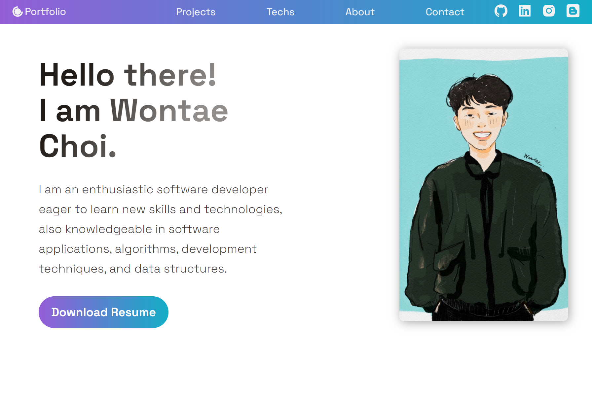

#### <em>"Don't reinvent the wheel."</em>

&nbsp;프로그래밍의 유명한 격언이라는데, 꼭 프로그래밍에만 쓰이지는 않는 것 같다.
직역하면 '바퀴를 다시 발명하지 말라'라는 뜻으로, 이미 다른 누군가가 개발해서
편하게 가져와 쓰면 되는 것을 시간을 들여 다시 만들 필요 없다는 말이다.

&nbsp;랜딩 페이지를 한달이 넘는 시간동안 낑낑대며 만들었다. 원래 개발이라는게 완성 단계에 도달했다고
생각했을 때 부터 예상치 못했던 문제가 이리저리 생기는 것이지만, 웹을 배포하고 아이폰으로
테스트를 했을 때 맞닥뜨린 새로운 버그들을 해결하러 열심히 구글링을 했었다. 그러던 도중 흔한 티스토리, 네이버
블로그가 아닌 자신이 직접 만들어서 배포까지 한 블로그를 찾았고, 많은 도움을 받아 버그를 해결할 수 있었다. 정말 멋졌다.

&nbsp;분명 그 전에도 개발 블로그에서 많은 도움을 받았고 그 덕에 프로젝트를 완성할 수 있었던
때도 많았었는데, 왜 그때서야 개발 블로그를 나도 하나쯤 말들어야 겠다는 생각을 했는지는 여전히
의아하다.

&nbsp;아무래도 네다섯개쯤 되는 프로젝트를 배포하고 자신감이 생겨서일거고, 진짜 이유는 도움 받았던 블로그에
"이 블로그는 Gatsby로 만들어졌습니다." 라는 문구 때문이다. 그 문구가 얼마나 멋있었는지 나도 한번쯤은 내 손으로
내 블로그를 만들어보고 싶었다.

&nbsp;다짐이 빠르면 의구심도 빨리 드는 법이다. 티스토리에 블로그 새로 하나 만들면 되지 굳이 왜 시간을 써서 만들려고 하는가?
9월달부터 다시 채용 시즌이 시작이 되면 알고리즘 공부하기도 바쁠 텐데, 자존심 세워서 시간 할애하지 않고 이미 만들어진
좋은 툴을 쓰면 되지 않는가?

&nbsp;실제로 DevDojo에서 블로그도 10분만에 만들었다. 남이 만들어 놓은 것을 안 써본게 아니다! 그렇지만 역시나 남이 만들어 놓은거라
내 마음대로 디자인 할 수가 없었고, 디자인을 한다고 해도 블로그 자체의 디자인 툴을 공부하는 데 시간이 들기에 그 시간에 내가 직접 만들기로 했다.

&nbsp;결론은 나도 이 블로그를 Gatsby를 이용해서 만들었다. 꼬박 3일동안 다른거 다 제치고 여기에만 올인했다...😂 돌아보면
진짜 징하다. 아직 매우 기초단계이고 추가해야할 기능들이 많지만(랜딩페이지의 악몽이
떠오른다...😅) 바깥 세상에 보여줄 수 있을 만한 디자인이 이쁘게 나온 것 같아 아주 만족스럽다. 필히 이후에는 Gatsby나 React를 더 배워가며
배운 점을 기록하는 여타 다를 것 없는 개발블로그가 될 테지만, 포트폴리오 만드느라 두달간 죽어라 고생했으니 초기 단계에는
그냥 일기장 처럼 하고 싶은 말 쓰는 블로그로 돌리고 싶다.

&nbsp;오늘은 여기까지, 원래 한 번에 다 쓰려고 하면 될 일도 안 되는 법이다🤣. 운동하러 가야지!
